# Sentinel

Real-time financial transaction fraud intelligence platform on Azure Databricks. Sentinel ingests a stream of banking transactions, maintains full customer behavioral history, scores transactions for fraud risk, and serves the results through a low-latency API and a fraud-analyst dashboard.

## Why I built this

At PwC I moved 300k+ employee records a week through batch integrations. Batch is the right tool for reconciliation and reporting, but it means a suspicious transaction is only visible hours after it settles, long after the moment fraud could be stopped. I built Sentinel to learn what real-time fraud detection actually requires at the infrastructure level: streaming ingestion, exactly-once processing, and a scoring path that answers within the payment window rather than the next batch cycle.

The platform is built on a Lambda architecture: a streaming path for low-latency ingestion and scoring, and a batch path for historical aggregation, feature engineering, and model retraining, both unified in Delta Lake on a medallion (bronze, silver, gold) layout.

## Architecture

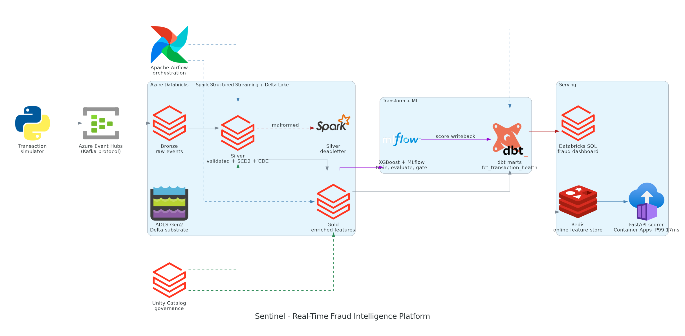


## Stack

| Layer | Technology |
|---|---|
| Streaming ingestion | Azure Event Hubs (Kafka protocol) |
| Processing | Azure Databricks, Spark Structured Streaming, Delta Lake |
| Transformation | dbt Core on Databricks |
| Orchestration | Apache Airflow |
| Machine learning | XGBoost, MLflow |
| Online features | Redis |
| Serving | FastAPI scorer, Databricks SQL dashboard |
| Governance | Unity Catalog column tags, row-level security, lineage |

## Repository structure

| Path | Purpose |
|---|---|
| `pipeline/bronze` | Structured Streaming ingestion from Event Hubs into bronze Delta |
| `pipeline/silver` | Validation, dead-letter routing, SCD2 customer history |
| `pipeline/gold` | Feature enrichment for downstream marts and scoring |
| `pipeline/maintenance` | OPTIMIZE and Z-order table maintenance |
| `pipeline/common` | Shared config and structured logging |
| `schema` | Delta table schema definitions |
| `simulator` | Synthetic transaction generator |
| `dbt` | Staging, intermediate, mart models and snapshots with tests |
| `ml` | Feature build, training, evaluation, feature store, score writeback |
| `airflow` | Pipeline orchestration DAG |
| `api` | FastAPI fraud scorer with Redis online features and latency benchmark |
| `redis` | Local Redis for the online feature store |
| `dashboard` | Databricks SQL queries for the fraud intelligence dashboard |
| `governance` | Unity Catalog column tags and row-level security policies |
| `docs/adr` | Architecture decision records |
| `docs/lineage.md` | Manually authored data lineage |

## Data pipeline

Transactions carry an operation type (insert, update, delete) and a change timestamp, so the silver layer models change data correctly rather than blindly upserting. The Delta MERGE closes a current SCD2 row on delete, opens a new version on update, and guards against out-of-order events by comparing change timestamps, so a late-arriving older event cannot overwrite newer state.

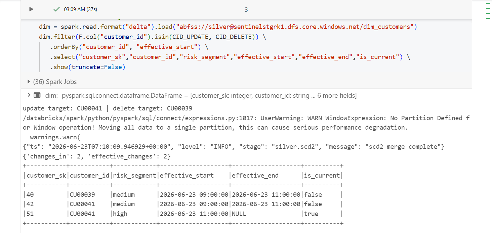

Records that fail validation route to a dead-letter table with error type and detail instead of crashing the job.

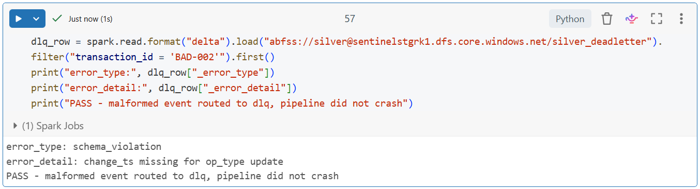

The pipeline is replay-safe. Re-running a completed batch is a no-op on already-applied rows, and an end-to-end reconciliation confirms bronze reconciles to silver plus distinct source rejections, with gold matching silver. The dead-letter table is append-only, so the reconciliation is keyed on distinct source offset rather than a raw row count.

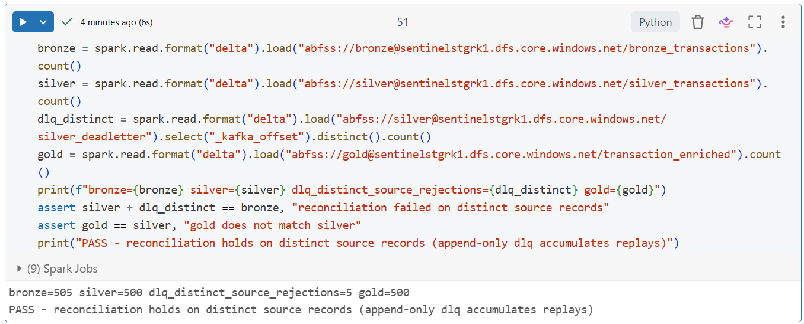

## Performance

Default Spark shuffle partitions are wasteful at this data volume, and the fact-to-dimension join shuffles unnecessarily. The pipeline sets shuffle partitions explicitly, broadcasts the small customer dimension to avoid a shuffle join, and runs OPTIMIZE with Z-order for point-lookup scan performance. Before-and-after timing is captured as evidence.

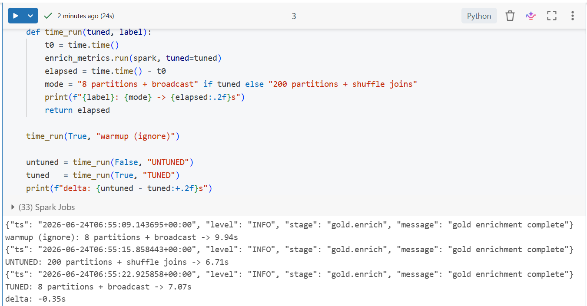

## Transformations and tests

dbt builds the staging, intermediate, and mart models, including `fct_transaction_health` as an incremental as-of join, with a `dim_customers` SCD2 snapshot and schema and data tests that gate the marts.

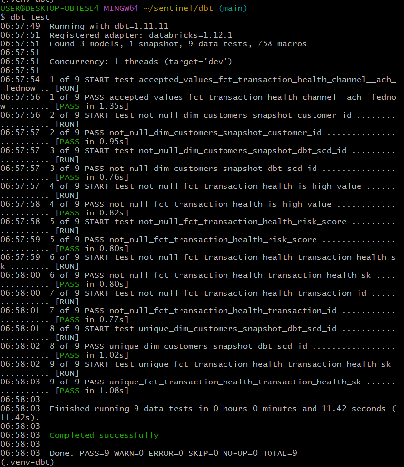

## Orchestration

Airflow orchestrates the streaming trigger, silver, gold, and dbt stages with retries, exponential backoff, and a failure callback, so a failed task is observable and recoverable.

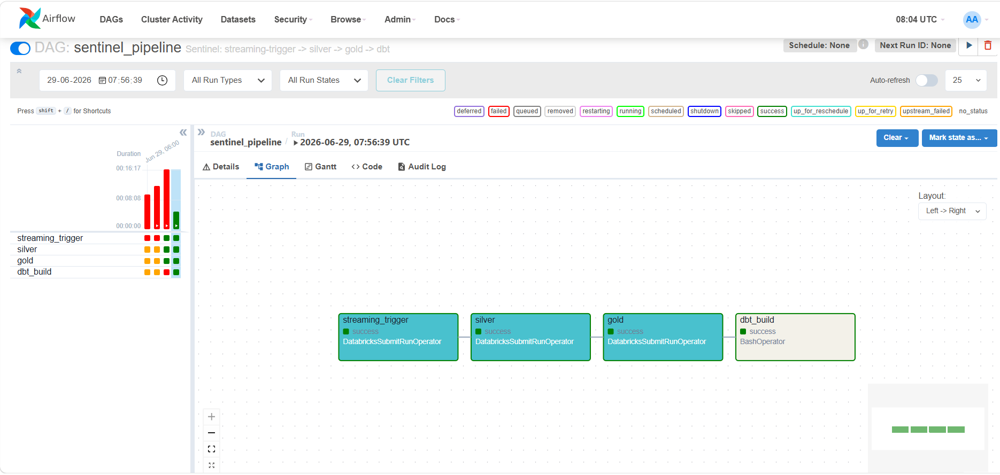

## Machine learning

An XGBoost model is trained on the enriched features with MLflow tracking, using a stratified split and `scale_pos_weight` to handle the class imbalance of 17 fraud cases in 500 transactions. Model selection uses 5-fold cross-validation so all 17 fraud cases contribute to an out-of-fold estimate, which is the trustworthy read on a dataset this small.

The cross-validated ROC-AUC is 0.412, below the 0.5 random-ranking baseline, with out-of-fold precision and recall near zero. A promotion gate registers the model but sets the `@champion` alias only if cross-validated ROC-AUC clears 0.60 and beats the heuristic baseline. The gate correctly refused promotion, so the champion alias is unset, scoring falls back to the newest registered version, and the score is tagged `unpromoted-dev-v1` end to end.

This is by design. The platform demonstrates the full training, tracking, evaluation, and promotion-gate flow, and the value is a gate that refuses a model that is not production-ready rather than a forced production tag. The cause is documented honestly: only 17 fraud cases exist and two planned features never propagated to the feature table, so the first real iteration is feature enrichment and more data. A PSI drift check is part of evaluation and genuinely fired, with a velocity PSI of 0.705 above the 0.2 drift threshold.

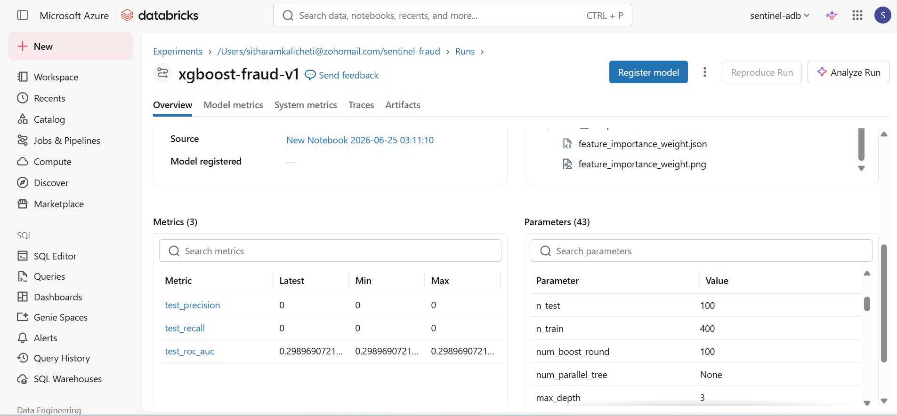

The dashboard model-quality panel shows a confusion matrix at the 0.5 threshold on the full scored population. Because scoring runs over the same population the model was trained on, those figures are an in-sample view of the serving surface, not a generalization estimate. The cross-validated ROC-AUC above is the honest measure of model quality.

## Serving

Slow per-customer aggregates are precomputed and served from Redis as an online feature store, while the live request carries the transaction-specific fields, so scoring meets a sub-100ms budget without recomputing aggregates per request. Train and serve parity is guaranteed by reindexing to the model's own feature names, so one-hot encoding cannot silently drift. The scorer is containerized and was deployed to Azure Container Apps with a health endpoint (`api/deploy.sh`). Measured warm-path latency is a P99 of 17ms, well within the 100ms budget.

## Governance

Unity Catalog governs the data with column tags for PII classification, a row-level security policy on the sensitive mart, and manually authored lineage in `docs/lineage.md`. The lineage is documented rather than presented as auto-generated, which is a Premium-tier feature not available on the Standard tier used here. One honest deviation is recorded in ADR 008: the row-level security policy allow-lists by current user rather than an account group, because the identity tenant used for this build could not create the account-level group.

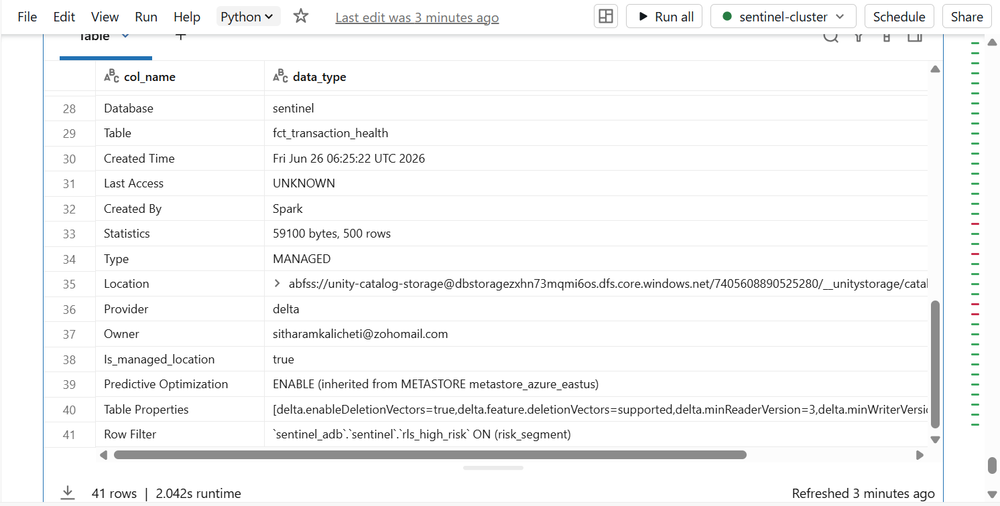

## Fraud intelligence dashboard

A Databricks SQL dashboard serves the fraud queue, SAR candidate list, model quality confusion matrix, score distribution, and geographic cross-border risk. The dashboard queries live in `dashboard`.

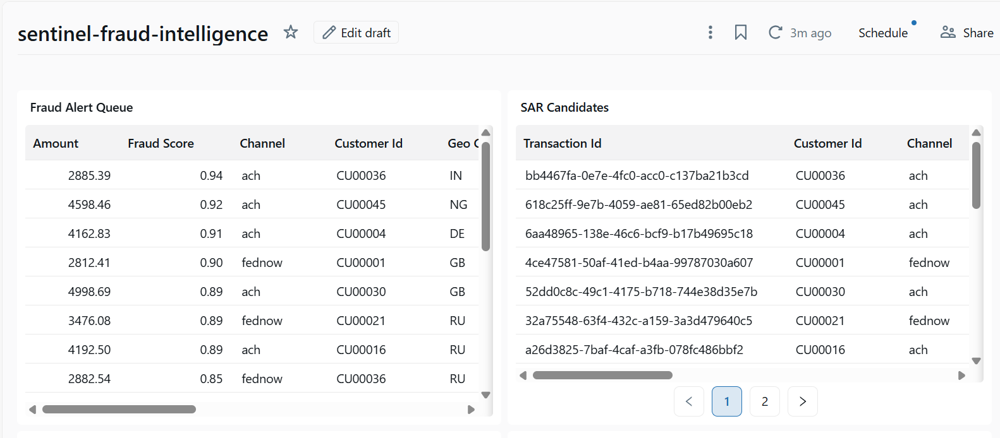

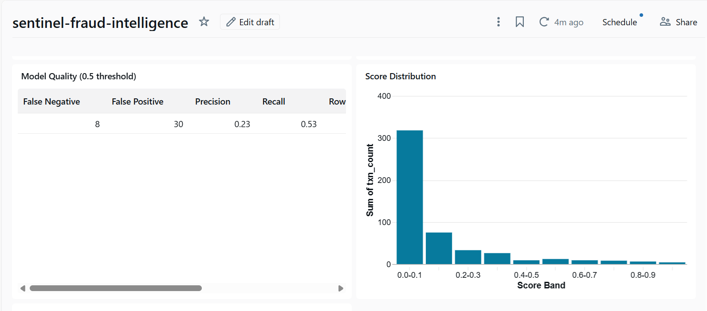

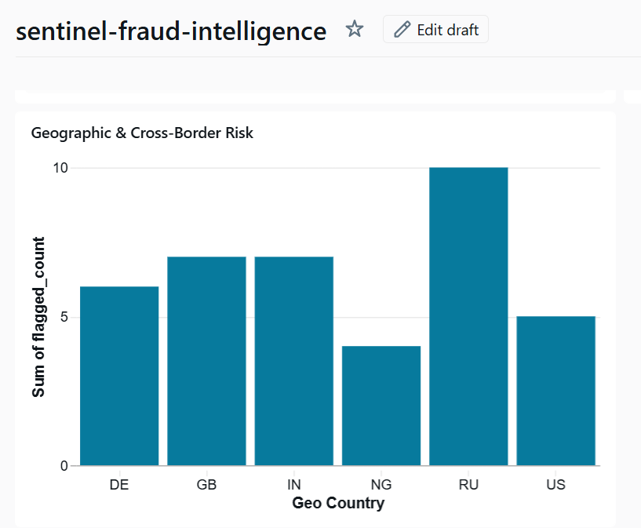

## Running the project

The streaming pipeline runs on Azure Databricks against live Azure resources (Event Hubs, ADLS Gen2, Unity Catalog), so it is not a single-command local run. The pieces below run locally, and the Databricks-hosted stages are deployed to a workspace.

Prerequisites for the full platform: an Azure subscription with Event Hubs, an ADLS Gen2 storage account, a Databricks workspace with Unity Catalog, and a secret scope holding the storage key.

Local components:

```bash
# online feature store
cd redis && docker compose up -d

# fraud scorer API
cd api && cp .env.example .env
docker build -t sentinel-scorer .
docker run --env-file .env -p 8000:8000 sentinel-scorer
curl http://localhost:8000/health
```

dbt against the Databricks warehouse:

```bash
cd dbt
dbt deps
dbt build
```

The Databricks pipeline modules under `pipeline` and `ml` run as jobs in the workspace, orchestrated by the Airflow DAG in `airflow/dags/sentinel_pipeline.py`. The transaction simulator under `simulator` publishes synthetic events to Event Hubs.

## Architecture decisions

The non-obvious choices are documented as architecture decision records in `docs/adr`:

- `001` Lambda vs Kappa architecture
- `002` Azure Event Hubs vs Kafka on Docker
- `003` SCD Type 2 customer history
- `004` XGBoost vs Spark MLlib
- `005` Idempotency and exactly-once recovery
- `006` Spark partition tuning and Delta Z-order
- `007` CDC merge semantics
- `008` Unity Catalog governance on Standard tier

## Lessons learned

The append-only dead-letter table accumulates rows across pipeline replays, so end-to-end reconciliation has to be keyed on distinct source offset rather than a raw row count. The naive count looks wrong until you account for replays.

A serverless SQL warehouse cannot read raw storage paths that only the all-purpose cluster holds the key for. The fraud labels used by the model-quality panel are therefore promoted from bronze into a governed table on the cluster first, then joined in the warehouse.

The dev-scale model did not beat the promotion gate. Rather than tune the threshold to produce a flattering number, the gate was left to do its job, and the honest cross-validated result is reported alongside the serving surface.