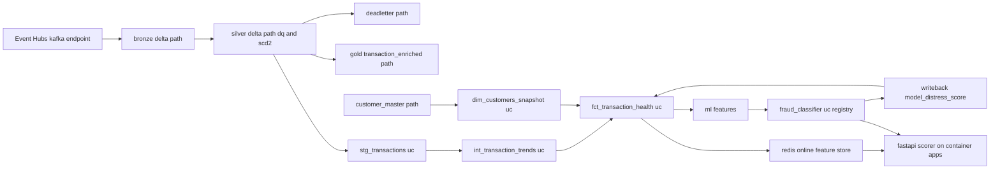

# Sentinel Data Lineage (manually maintained)

This diagram is maintained by hand. Unity Catalog automatic lineage is not
available end to end for this project because the bronze, silver, and gold
layers are path-based Delta tables outside Unity Catalog (the Hive metastore
is disabled and cross-subscription storage-credential registration is blocked).
Only the dbt marts and the registered model live in Unity Catalog, so UC can
auto-generate lineage for those objects alone. The graph below is the honest
source of truth for the full cross-layer flow, and it is updated by hand when
the pipeline changes. It is not generated by Unity Catalog.

## Governance coverage

| Layer | Storage | Unity Catalog governed | Lineage source |
| --- | --- | --- | --- |
| bronze / silver / gold | path-based Delta on ADLS | no | this document |
| dbt marts (fct, dim, int, stg) | Unity Catalog managed | yes | UC plus this document |
| fraud_classifier | Unity Catalog registry | yes | UC plus this document |
| redis feature store and scorer | Azure Cache and Container Apps | no | this document |

## PII fields tagged

`customer_id`, `home_country`, and `account_open_date` carry Unity Catalog PII
tags. A production schema would also carry `account_no` and `ssn_hash`; the
synthetic data used here does not include them, so they are named here rather
than tagged on columns that do not exist.